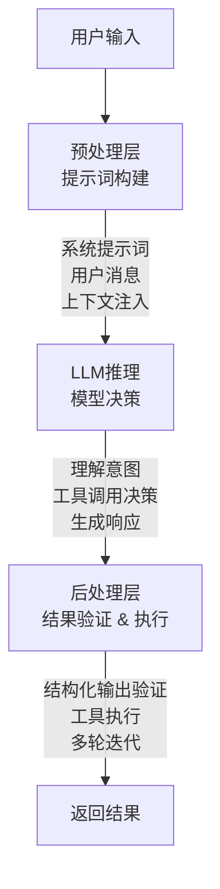
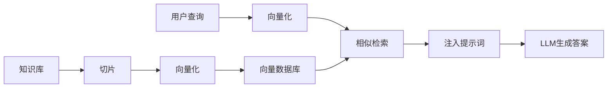
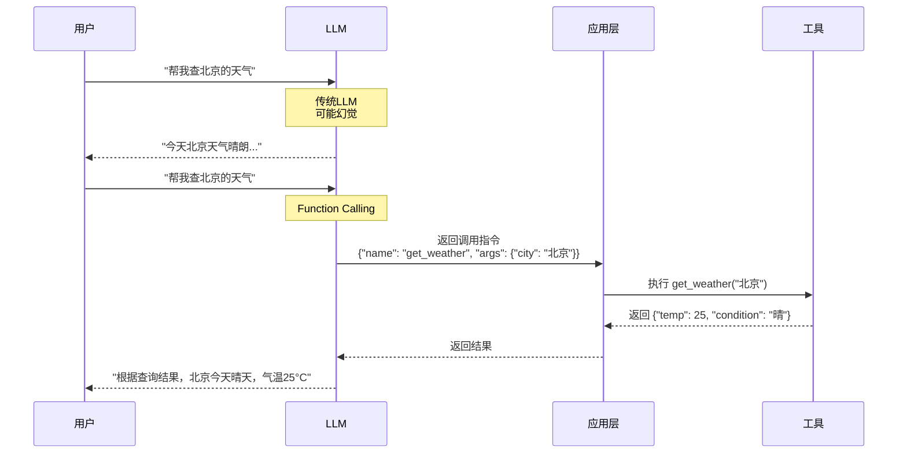
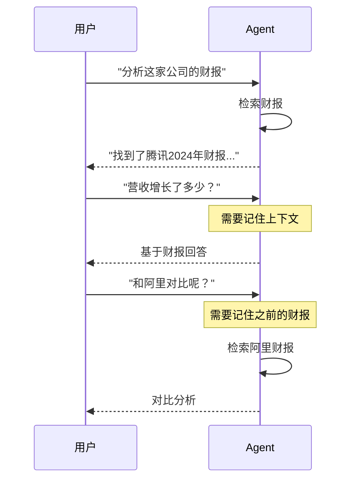
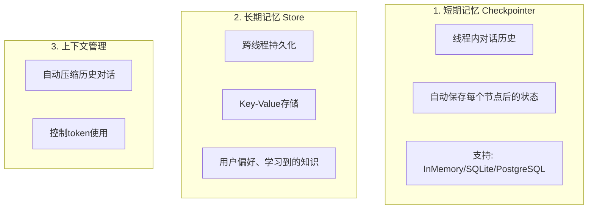
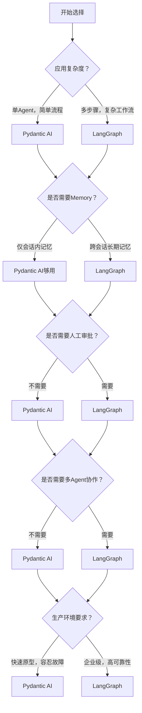

如果你有其他开发经验但不熟悉LLM应用，这篇文章会帮你理解这个领域的基础概念。

传统应用遵循确定性逻辑：输入 → 处理 → 输出。LLM应用引入了概率性推理，模型基于上下文和提示词做决策。这需要新的架构模式。

内容包括：
- LLM应用的基本架构
- Function Calling、RAG等能力
- LangGraph vs Pydantic AI框架对比
- 技术选型建议

<!--more-->

# 一、LLM应用基本架构

## 1.1 从传统应用到LLM应用

传统应用：代码定义业务逻辑，数据驱动流程，输出是确定性的。LLM应用不同：

```
传统应用: 代码逻辑 → 确定性执行
LLM应用: 提示词 + 上下文 → 概率性推理
```

需要新的架构模式来管理这种不确定性。

## 1.2 LLM应用的分层架构

LLM应用通常分为四层：



**预处理层**：将用户输入转换为模型可理解的提示词，包括系统提示词、用户消息、上下文注入。

**LLM推理层**：模型基于提示词推理，决定直接回答、调用工具或继续交互。

**后处理层**：验证输出格式、执行工具调用、决定是否继续对话。

## 1.3 主要架构模式

### RAG（检索增强生成）

LLM的知识是静态的，无法访问私有数据或最新信息。RAG通过在推理时注入相关文档解决这个限制。



生产级RAG需要考虑：
- 切片策略：如何分割文档
- 向量数据库：Pinecone、Weaviate、pgvector等
- 检索优化：混合检索、重排序
- 评估：检索准确率、答案质量

### Function Calling（工具调用）

Function Calling让LLM调用外部工具。模型不直接执行函数，而是返回调用指令，应用层执行。



要点：
- 可靠性：GPT-4/Claude达95%+，开源模型60-75%
- 并行调用：降低2-3倍延迟
- 成本：增加15-30% token开销

# 二、LLM能力详解

## 2.1 Function Calling / Tool Use

Function Calling的本质：模型作为路由器，将自然语言转换为函数调用。

### 工作原理

1. 定义工具：向模型描述工具名称、参数和用途
2. 模型决策：分析用户意图，决定是否调用工具
3. 返回调用指令：返回函数名和参数（不执行）
4. 应用执行：执行函数，返回结果
5. 生成答案：基于工具结果生成回复

### 应用场景

| 场景 | 示例 |
|------|------|
| 数据查询 | "查用户123的订单" → 查询数据库 |
| API集成 | "发邮件给团队" → 调用邮件API |
| 计算 | "算CSV平均值" → 执行Python代码 |
| 系统操作 | "部署到测试环境" → 调用CI/CD |

### 可靠性

不同模型差异显著：
- GPT-4 / Claude：95%+准确率
- 开源模型（Llama 3.1+, Mistral）：60-75%

建议：
1. 使用Pydantic验证参数
2. 实现重试机制
3. 提供降级方案

## 2.2 Structured Output（结构化输出）

强制模型返回符合Schema的JSON数据，适用于数据提取、分类、表单填充等场景。

实现方式：
- OpenAI：`zodResponseFormat` + Zod schema
- Pydantic AI：原生Pydantic模型验证
- LangGraph：通过工具和状态管理实现

## 2.3 RAG架构演进

**Level 1: Naive RAG**
```
文档 → 固定切片 → Embedding → 向量库
查询 → Embedding → Top-K检索 → 生成答案
```

问题：检索质量不稳定，容易遗漏信息。

**Level 2: Advanced RAG**
- 查询重写：优化查询，提高检索准确率
- 混合检索：向量 + BM25关键词
- 重排序：Cross-Encoder重新排序
- 多查询：生成多个查询变体

**Level 3: Agentic RAG**
Agent动态决定检索策略：
- 分析问题类型，选择数据源
- 迭代检索，完善答案
- 自我验证

## 2.4 多轮对话与状态管理

LLM应用需要管理对话历史和中间状态：



需要：
- 会话管理：关联对话历史
- 状态持久化：跨会话保存信息
- 上下文窗口管理：压缩或总结历史

# 三、Agent开发框架对比

开发LLM应用时，需要决定是否使用框架，选择哪个框架。

## 3.1 为什么需要Agent框架？

直接使用LLM API可行，但会遇到这些问题：

| 问题 | 手动实现成本 | 框架支持 |
|------|-------------|---------|
| 工具调用循环 | 高 | 内置 |
| 对话历史管理 | 中 | 内置 |
| 错误处理 | 高 | 内置 |
| 状态持久化 | 高 | 内置 |
| 多Agent协作 | 极高 | 内置 |
| 可观测性 | 中 | 内置 |

框架封装了这些能力，让你聚焦业务逻辑。

## 3.2 LangGraph vs Pydantic AI

主流Agent框架LangGraph和Pydantic AI，设计哲学不同。

### 核心能力对比

| 能力维度 | LangGraph | Pydantic AI |
|---------|-----------|-------------|
| 核心定位 | 工作流编排平台 | 类型安全Agent框架 |
| 工作流编排 | ✅ 核心，显式状态机 | 🟡 pydantic-graph（基础） |
| 并行执行 | ✅ 静态+动态 | ❌ 无 |
| 条件路由 | ✅ 条件edges | ❌ 需手动实现 |
| Memory | ✅ 短期+长期，多后端 | ⚠️ 需集成外部工具 |
| 时间旅行 | ✅ 重放/分支/调试 | ❌ 无 |
| 错误处理 | ✅ 4层容错 | ⚠️ 需手动实现 |
| 人机协作 | ✅ 原生支持 | ❌ 需自行实现 |
| Skill系统 | ✅ 官方11个skills | ❌ 无官方支持 |
| MCP支持 | ✅ 通过适配器 | ✅ 原生支持 |
| 可视化调试 | ✅ LangGraph Studio | ❌ 无官方工具 |
| 部署选项 | ✅ Cloud/Hybrid/Self-hosted | ⚠️ 需自行部署 |
| 类型安全 | ⚠️ TypedDict，无输出验证 | ✅ Pydantic原生验证 |
| 生态成熟度 | ✅ 大型社区，生产验证 | 🟡 新兴框架 |

### 设计哲学差异

**LangGraph = 工作流操作系统**

设计灵感来自Google Pregel和Apache Beam，用显式图结构编排工作流。

```
LangGraph工作流示例:

         [路由器]
           ├─ 简单问题? → [快速响应]
           ├─ 需要查询? → [搜索] → [验证]
           ├─ 需要计算? → [计算器] → [格式化]
           └─ 需要审批? → [人工审核] → [执行]
```

特性：
- 状态机模型：清晰的节点和边
- Checkpoint机制：状态持久化，崩溃恢复
- 循环支持：重试、自纠正
- 并行执行：fan-out/fan-in
- 人机协作：暂停等待审批

**Pydantic AI = 类型安全Agent SDK**

将FastAPI的理念带入AI：类型安全优先。

```python
# Pydantic AI示例
class MyAgent(Agent[DatabaseDeps, ResultType]):
    @tool
    async def query_data(
        self,
        ctx: RunContext[DatabaseDeps]
    ) -> Result:
        # 编译时类型检查
        # 运行时Pydantic验证
        ...
```

特性：
- 编译时类型检查：IDE自动补全
- 运行时验证：Pydantic验证输入输出
- 依赖注入：类似FastAPI
- 代码量少：相同功能约160行 vs LangGraph 280行

### 适用场景

**选择LangGraph：**
- 复杂多步骤工作流
- 状态持久化和崩溃恢复
- 人工审批环节
- 多Agent协作
- 时间旅行调试
- 企业级生产环境

**选择Pydantic AI：**
- 单Agent应用
- 类型安全核心需求
- 团队熟悉Pydantic和FastAPI
- 快速原型开发
- 数据质量要求高

## 3.3 Memory支持

Memory是LLM应用的需求，两个框架支持程度差异显著。

### LangGraph Memory架构

LangGraph提供三层Memory：



效果：
```
用户A (第1次对话): "我是产品经理"
  → LangGraph自动保存到长期记忆

用户A (第50次对话): "推荐一些工具"
  → Agent从长期记忆读取用户职业
  → 推荐产品经理相关工具
```

### Pydantic AI Memory现状

Pydantic AI提供基础的`message_history`，但仅限于单次会话。要实现跨会话记忆，需要：
1. 集成外部工具：Mem0、MongoDB等
2. 自行设计memory schema
3. 实现记忆读写逻辑

开发成本和维护负担更高。

## 3.4 Skill系统

Skill系统决定了Agent能力的可扩展性。

### LangGraph Skills

LangGraph提供官方Skill生态系统，包含11个预构建skills：

| Skill类别 | Skills |
|----------|--------|
| LangChain | fundamentals, middleware, RAG |
| LangGraph | fundamentals, persistence, human-in-the-loop |
| Deep Agents | core, memory, orchestration |

工作原理：
```
传统方式:
  提示词 = 系统指令 + 所有工具说明 + 所有知识
  → Token浪费，性能下降

Skill方式 (Progressive Disclosure):
  1. Agent看到技能目录 (轻量级，约500 tokens)
  2. 按需加载详细技能文档
  3. 动态执行

效果:
  • 性能提升: 25% → 95%
  • Token节省: 60-70%
```

Skill动态加载，不会一次性塞满系统提示词。

### Pydantic AI现状

Pydantic AI没有官方Skill系统，需要开发者自行设计存储、加载、发现机制。

## 3.5 生产级能力对比

### 时间旅行调试

**LangGraph**提供时间旅行功能，基于checkpoint机制：

```
应用场景:
━━━━━━━━━━━━━━━━━━━━━━━━━━━━

1. 生产调试:
   用户报告第8步失败
   → 加载第7步checkpoint
   → 检查状态
   → 从第7步重新执行
   → 无需重跑1-7步

2. What-If分析:
   原始执行失败
   → 修改工具返回值
   → 从失败点分支继续
   → 探索不同路径

3. 审计和回溯:
   可视化每一步的状态
   → 定位问题根源
```

**Pydantic AI**无此功能，需要开发者自己实现状态追踪。

### 错误处理

**LangGraph**提供4层容错机制：

```
Layer 1: Retry Policies
  API返回503?
  → 自动重试3次
  → 指数退避 (1s → 4s → 10s)
  → 成功率: 90%

Layer 2: Fallback Edges
  工具A失败?
  → 条件路由到工具B
  → 降级策略

Layer 3: Error Classification
  分类错误:
  • 暂时性错误 → 重试
  • LLM可恢复 → 换个提示词
  • 需要人工 → human-in-the-loop

Layer 4: Checkpoint Recovery
  进程崩溃?
  → 从最后checkpoint恢复
  → 不丢失进度
```

**Pydantic AI**需要开发者手动实现这些容错逻辑。

### 部署选项

**LangGraph (LangSmith Deployment)** 提供3种部署模式：

1. **Cloud**：完全托管，git push即部署
2. **Hybrid**：运行在你的云上，LangSmith控制平面管理
3. **Self-hosted**：完全自托管，Kubernetes部署

所有模式都支持自动扩缩容、状态持久化、人机协作API、版本管理。

**Pydantic AI**需要开发者自己搭建部署方案，选择基础设施，实现扩容和监控。

### 可视化调试

**LangGraph Studio**提供可视化IDE：实时可视化执行流程、点击节点查看状态、编辑中间状态、从任意节点重放、查看token消耗、性能分析。

**Pydantic AI**无官方可视化工具，需要依赖第三方或自己搭建。

# 四、企业级应用：为什么推荐LangGraph

## 4.1 复杂工作流

企业级应用往往涉及：

```
多步骤任务:
  用户请求 → 意图识别 → 数据检索 → 分析计算 → 结果验证 → 人工审批 → 执行

失败处理:
  步骤5验证失败?
  → 重试3次
  → 仍失败?
  → 降级方案
  → 记录日志
  → 通知人工

长时间运行:
  任务可能持续数小时甚至数天
  → 需要checkpoint机制
  → 支持崩溃恢复
```

LangGraph的设计为这些场景而生：显式状态机、checkpoint持久化、条件路由、循环重试。

## 4.2 Memory需求

企业级应用需要跨会话记忆：

```
客服机器人:
  第1次对话: 用户反映产品问题
  第3次对话: 询问问题解决进度
  → 需要记住第1次的上下文

研究助手:
  第1次对话: "分析腾讯财报"
  第5次对话: "和阿里对比"
  → 需要记住之前分析的财报

个性化推荐:
  长期记忆用户的偏好、职业、兴趣
  → 提供个性化服务
```

LangGraph内置Memory支持。Pydantic AI需要大量开发工作。

## 4.3 生产可靠性

企业级应用对可靠性要求高：

| 需求 | LangGraph支持 | 自建成本 |
|------|-------------|---------|
| 状态持久化 | ✅ 多后端支持 | 中 |
| 崩溃恢复 | ✅ Checkpoint机制 | 高 |
| 人机协作 | ✅ 原生支持 | 中 |
| 错误处理 | ✅ 4层容错 | 高 |
| 可观测性 | ✅ LangSmith集成 | 中 |
| 部署扩容 | ✅ LangSmith Deployment | 高 |

使用LangGraph，这些能力开箱即用。使用Pydantic AI，需要投入开发资源。

## 4.4 实际案例

LangGraph已被多家大公司采用：

- **Klarna**：客服助手，每日处理百万级对话，多步骤意图识别，集成多个后端系统
- **Uber**：复杂工作流编排
- **LinkedIn**：多Agent协作场景
- **GitLab**：AI辅助开发工具

这些案例验证了LangGraph在生产环境的可靠性。

## 4.5 开发效率对比

假设要构建一个需要以下能力的Agent应用：

| 能力 | LangGraph | Pydantic AI + 自建 |
|------|-----------|-------------------|
| 工作流编排 | 内置，1天 | 需开发，3-5天 |
| Memory | 内置，0.5天 | 需集成，2-3天 |
| 错误处理 | 内置，0.5天 | 需开发，2-3天 |
| 人机协作 | 内置，0.5天 | 需开发，1-2天 |
| 可观测性 | 内置，0.5天 | 需集成，1-2天 |
| **总计** | **3天** | **9-15天** |

使用LangGraph，开发效率提升3-5倍。

## 4.6 何时选择Pydantic AI

LangGraph在企业级场景优势明显，但Pydantic AI在以下场景更合适：

- **单Agent应用**：无需复杂编排
- **类型安全核心需求**：数据验证至关重要
- **团队Pydantic经验**：已有Pydantic/FastAPI经验
- **快速原型**：快速验证想法

例如：
- 数据提取API：从文本中提取结构化数据
- 内容分类服务：将文章分类到预定义类别
- 表单填充助手：解析用户描述，生成结构化表单

这些场景不需要复杂工作流，Pydantic AI的类型安全优势更突出。

# 五、总结与建议

## 5.1 决策框架

选择Agent框架时，问自己这些问题：



## 5.2 学习路径

**新手：**
1. 先用原生LLM API实现简单聊天机器人
2. 理解Function Calling
3. 尝试实现RAG（使用Pinecone或pgvector）
4. 根据项目需求选择框架

**有经验开发者：**
1. 直接上手LangGraph或Pydantic AI
2. 构建中等复杂度的Agent应用
3. 深入理解状态管理和错误处理
4. 探索高级特性（时间旅行、并行执行等）

## 5.3 实战建议

**不要过度设计**

很多LLM应用不需要复杂的Agent框架。如果只是简单的问答或内容生成，直接调用API可能更合适。

**从简单开始**

先用最简单的方式实现功能，验证价值后再引入框架。过早使用框架可能增加不必要的复杂度。

**重视可观测性**

LLM应用的黑盒特性使得调试困难。从一开始就集成追踪工具（LangSmith、Langfuse等），记录每次LLM调用和工具执行。

**测试驱动**

LLM输出的不确定性要求更严格的测试：
- 单元测试：测试各个工具函数
- 集成测试：测试完整工作流
- 回归测试：确保修改后输出质量不下降
- A/B测试：比较不同提示词的效果

## 5.4 未来展望

LLM应用开发还在快速演进：
- 模型能力提升：更可靠的Function Calling，更长的上下文窗口
- 框架成熟：更多生产级能力内置
- 标准化：MCP等协议标准化工具集成
- 多模态：图像、音频、视频处理能力

保持学习，关注最新进展，但不要追逐每个新框架。理解核心原理比掌握具体工具更重要。

# 结语

LLM应用开发正在改变软件的构建方式。选择合适的框架是成功的一步。

没有最好的框架，只有最适合的框架。根据项目需求、团队能力和业务目标做出选择。

希望这篇文章能帮你快速入门LLM应用开发。有问题欢迎留言讨论。